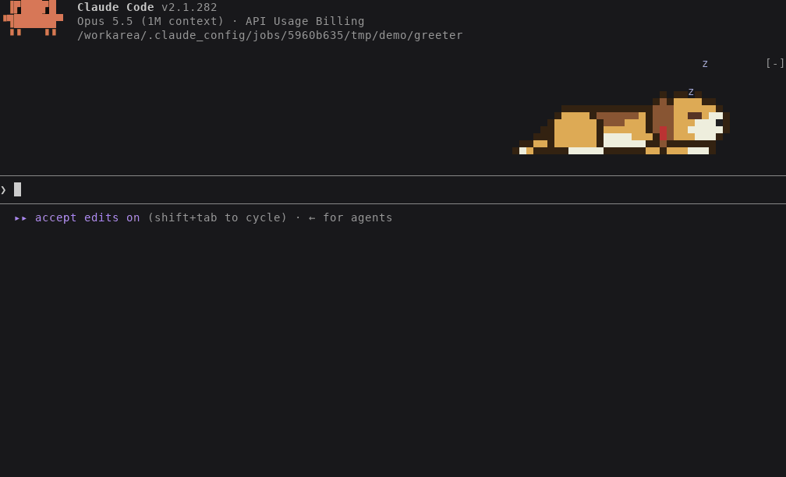

# pet

`snoozing-dog`, a Claude Code mod that puts a pixel-art animal in the band
above the prompt: a dog by default, or a camel, or a solid gray cat. The animal
snoozes while Claude is idle, and wakes up to react while Claude works. Tested
with Claude Code v2.1.281 in a terminal. The Desktop app gets no animal.



## Run it

This repository is also a plugin marketplace. To install the mod for every
session:

```bash
claude plugin marketplace add philipcraig/pet
claude plugin install snoozing-dog@pet
```

To try it for one session, clone this repository, then load the clone's
directory:

```bash
export CLAUDE_CODE_ENABLE_FUNCTION_HOOKS=1
claude --plugin-dir ./pet
```

Builds older than v2.1.287 need `CLAUDE_CODE_ENABLE_FUNCTION_HOOKS=1`, both to
try the mod and after installing it. Later builds ignore it. Export the
variable rather than putting it in front of `claude` on the same line, which
doesn't reach Claude Code if `claude` is a shell alias.

## What the animal does

While Claude is idle, the animal sleeps and breathes, with z's drifting up. Every
10 to 25 seconds it does one of these: twitches an ear, thumps its tail,
paddles its paws in a dream, yawns, sits up to scratch, makes a sleepy noise,
rolls onto its back, turns round and lies down again, opens one eye, or
dreams. The camel dreams of a cactus or water, the cat of a fish or a mouse,
and the dog of a bone or a squirrel. Typing in the prompt makes its ear twitch.

While Claude works, the animal reacts to what Claude is doing:

| Claude is | The animal |
| :- | :- |
| Starting a turn | Wakes up and stretches, if it was lying down |
| Thinking or writing | Sits and listens, tilting its head |
| Reading or searching (`Read`, `Grep`, `Glob`) | Sniffs back and forth, nose down |
| Editing (`Edit`, `Write`) | Digs, with dirt flying |
| Running a shell command (`Bash`) | Chases a bouncing ball |
| Calling the web or an MCP tool | Points, one paw raised |
| Running subagents | Plays with one baby for each subagent, up to three |
| Hitting a failed tool call | Jumps with a `!`, then droops its ears |
| Interrupted, or refused a tool call | Droops its ears and head |
| Working for more than two minutes | Pants |
| Finishing a turn | Wags with a heart, yawns, and lies down to sleep |

## Commands

- `/pet`: shows or hides the animal. The choice persists between sessions.
- `/pet on`, `/pet off`: shows or hides the animal.
- `/pet pet`: the animal rolls over for a belly rub.
- `/pet feed`: the animal eats its favorite food: a fish for the cat, a bone
  for the dog, a cactus for the camel.
- `/pet camel`, `/pet cat`, `/pet dog`: switches the animal. The choice
  persists between sessions.

## Files

- `hooks/register.js`: the hooks module. It handles events and draws the band.
- `hooks/animal.js`: picks the animal's pose from Claude's activity and the time.
- `hooks/scene.js`: defines each animal, draws the pixel art, and packs it
  into `Raster` cells.
- `tests/`: run with `claude plugin test` from this directory.
- `dev/preview.mjs`: renders a scripted session to a PNG contact sheet, as in
  `node dev/preview.mjs sheet.png cat`.
